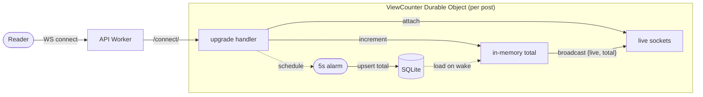

I want a live view counter on each of my blog posts.

Requirements:

1. Live. The count goes up when someone joins and down when they leave, no page reload.
2. No hit to page load times.
3. Persist totals so I can query all-time views per post.

I'm building it on Cloudflare Durable Objects.

The [last post](/posts/event-sourcing-cloudflare) was a long walk through an event-sourced backend on Workers and Durable Objects. This one is much smaller: a stateful object per post that tracks who's reading, fans updates out to connected readers over WebSocket, and saves totals to SQLite when things go quiet.

## The architecture

Three pieces:

- A Durable Object (Rust) per post that holds state and WebSocket connections.
- An API Worker (Rust) that handles CORS and forwards WebSocket upgrades.
- A ViewCounter component (Astro) that opens the socket and renders the numbers.

Each post gets its own Durable Object instance, keyed by slug. That keeps state isolated per page and avoids any cross-post coordination.

When someone opens a post, the Astro frontend connects to `/connect/<slug>` on the API Worker. The Worker resolves the Durable Object instance for that slug and forwards the WebSocket upgrade.

Each Durable Object only handles readers for a single post. It keeps the active sockets in memory and maintains an in-memory total view counter.

The handshake itself is the "view event". When the `fetch` handler receives a WebSocket upgrade request, it:

1. Ensures the in-memory state is initialized (loading totals from SQLite if this is a fresh wake).
2. Increments the in-memory total.
3. Upgrades the connection and starts tracking the socket.
4. Broadcasts the new `{ live, total }` state to every connected reader.
5. Sets a 5-second alarm to persist the change.

By counting the view during the handshake, the frontend doesn't need to send any initial messages. It just connects and listens.

### Handling hibernation

Durable Objects can be evicted from memory when idle to save resources. When a new reader joins or an alarm fires, the object wakes back up.

In the DO entry point, if the in-memory state is empty, it loads the last known total from the local SQLite database. This ensures that even if the object was hibernating, the next reader sees the correct view counts.

### Disconnect handling

When a reader navigates away or closes the tab, the socket closes and `websocket_close` fires. The DO broadcasts a new count to whoever is still connected.

One subtle thing: when `websocket_close` fires, the closing socket is still counted in the socket list. If you just count sockets, you'll get **N instead of N-1**. The fix is to subtract one when broadcasting from the close handler.

## Astro integration

The `ViewCounter` component renders two spans and runs a client-side script.

On `astro:page-load` it opens a socket to:

`wss://counter.kgdev.me/api/v1/connect/<slug>`

It updates the spans whenever a message arrives. Because the backend broadcasts the initial state immediately after the connection is established, the frontend remains completely passive.

The awkward bit is Astro's View Transitions. Module scripts only run once per full page load, not on each client-side navigation. So the component listens to `astro:before-preparation` to close the old socket before navigation, and `astro:page-load` to open a new one after.

Reconnecting is cheap and the DO instance is already warm, so this works fine. A long-lived socket that swaps slugs on each navigation would be more complexity for no real gain.

## Security

I have added some basic server-side validation and edge controls to ensure only legitimate requests are processed and to prevent abuse.

### CORS

The API Worker enforces a basic CORS policy on incoming requests.

The `Origin` header is set by the browser, so anyone running curl or a raw WebSocket client can put `Origin: https://kgdev.me` on their request get through. Server-side CORS only stops browsers on other origins. It does nothing to stop scripts.

### Validated slugs

The slug is validated against a whitelist of known blog posts before the request reaches the Durable Object. This prevents arbitrary or invalid slugs from creating new Durable Objects.

### Rate limiting

Cloudflare [Rate Limiting Rules](https://developers.cloudflare.com/waf/rate-limiting-rules/) are enabled at the edge. This caps WebSocket upgrades per IP before they reach the Worker.

[Bot Fight Mode](https://developers.cloudflare.com/bots/get-started/bot-fight-mode/) is also active to catch automated traffic.

## Pricing

How much does this cost to run? For a personal blog, basically nothing.

The Workers Paid plan ($5/month floor) [includes](https://developers.cloudflare.com/durable-objects/platform/pricing/) per month:

- 1M requests
- 400,000 GB-seconds of duration
- 5 GB of SQLite storage
- 25B row reads, 50M row writes

A few things keep this counter cheap:

- Hibernation. Outgoing WebSocket messages are free. Incoming messages bill at 20:1, and because the client sends almost nothing after the connection is established, request usage stays extremely low. While a reader idles on a post, the DO can hibernate between events and burns no duration while idle.
- Sharded objects. Each post has its own Durable Object instance, so activity on one page doesn't affect another.
- Quiet writes. SQLite is only touched after five seconds of inactivity.

Everything stays inside the free tier. The $5/month floor is the bill, and I'd be paying it for the rest of my Cloudflare stack anyway.

## Conclusion

This was a fun little project and a nice demonstration of how easy it is to add interactivity to your site with Durable Objects.

The code for the counter can be found [here](https://github.com/kieran-gray/blog-view-counter).

Thanks for reading.
