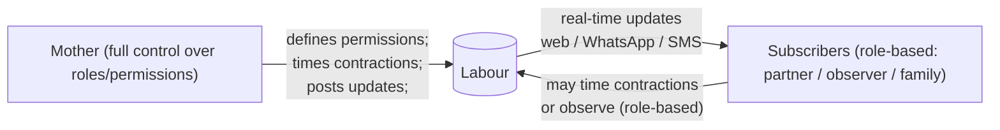
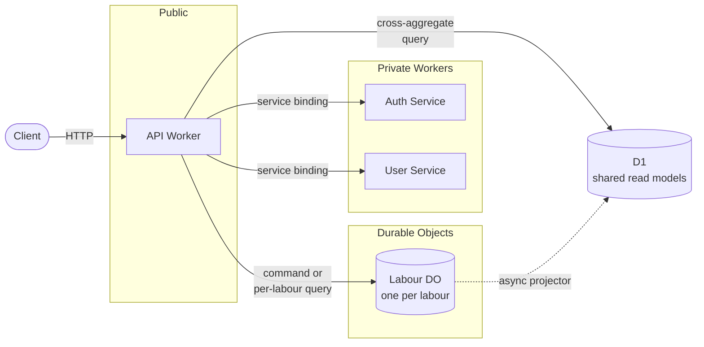
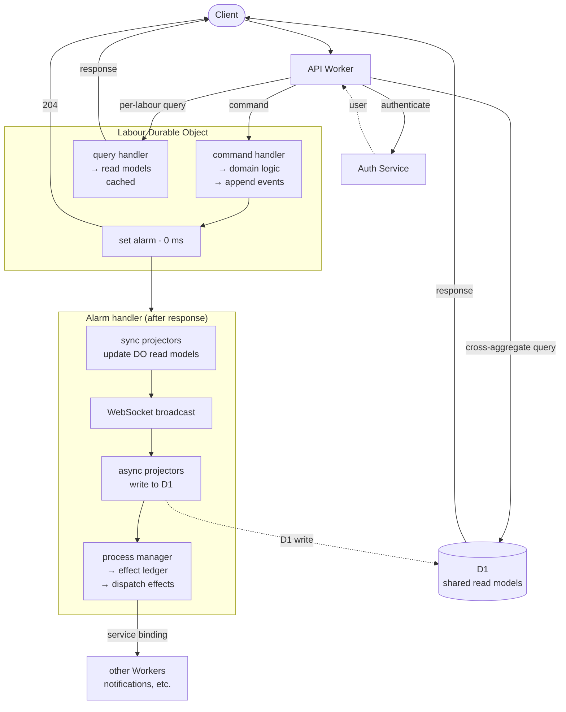

I rebuilt the backend of FernLabour.com on Cloudflare Workers and Durable Objects in Rust. The result is an event-sourced system where each labour runs inside its own Durable Object with its own SQLite event store, projections, and WebSocket subscribers.

## What FernLabour does

Quick context before diving in. [FernLabour](https://fernlabour.com) is a labour tracking app: a mother in labour (or someone with her) times contractions, posts updates, and pushes real-time notifications to the family members who want to follow along without being in the room.

It’s more than a single-device stopwatch, though. The mother can invite loved ones to subscribe and can control what level of access they have: she can allow birth partners and other trusted people to actively participate in tracking contractions and posting updates from their own devices, while others may be invited purely as observers. Multiple people can therefore be involved in recording and updating the labour at the same time (ever tried to make a distributed stopwatch? It's a whole other blog post). Subscribed family members typically sit in an observer role: they don’t time contractions or modify the labour state, but instead receive real-time updates via the web app, WhatsApp, or SMS.



## The original stack and why it had to change

The original backend was written in Python and ran on GCP. It worked fine, but it cost around £93 a month: a Compute Engine instance for Keycloak and Pub/Sub consumers (£30), Cloud SQL for Postgres (£26), a load balancer (£20), Cloud Run services (£15), plus some extra bits. A lot for a small side project. I knew I’d eventually run out of free credits and would have to either shut it down or rethink the architecture.

Instead of continuing to work on the GCP stack, I experimented with Cloudflare Workers and Durable Objects. They offer a very different model: per-entity compute with state bundled in the same process, automatic global placement near whoever first used the thing, and no idle cost when nothing is happening. I also used the rewrite as an excuse to move the backend to Rust, largely because it’s a language I enjoy working in.

The resulting Cloudflare setup costs about £3.80 ($5) per month for the Workers Paid plan, and the current traffic still sits comfortably inside the free usage tier.

This post is a long walkthrough of the final architecture. If you’re new to Cloudflare Workers, we’ll start with the basics. If you’re experienced, the core insights are in the middle: details on CQRS and event sourcing with Durable Objects, why some projectors run synchronously versus asynchronously, and the process manager’s role in orchestrating actions.

I'll be pointing at real code from the [fern-labour-cloudflare](https://github.com/kieran-gray/fern-labour-cloudflare) repo as we go.

## The Cloudflare stack (a quick tour)

The usual mental model for a backend is a set of separate services: application servers handling requests, a database for persistence, a message bus for background work, and often a cache alongside them. Cloudflare’s stack replaces that collection of infrastructure with a smaller set of primitives that run at the edge across hundreds of data centres, with a very different set of constraints.

Here's just enough of it to understand what comes next.

### Workers

A Cloudflare Worker is a serverless function that runs in a [V8 isolate](https://developers.cloudflare.com/workers/reference/how-workers-works/) at one of Cloudflare's data centres. Isolates start in milliseconds instead of seconds, which means Workers can actually scale to zero; there's no container to keep warm, so you pay per request and nothing in between.

Workers can be written in JavaScript, TypeScript, Python, or Rust. I went with Rust, which compiles to WebAssembly through the [`workers-rs`](https://github.com/cloudflare/workers-rs) crate.

A Worker can be public via a URL or private via a service binding. A service binding lets one Worker call another inside the same Cloudflare process, with no HTTP round-trip and no overhead. This makes it easier to split a large app into smaller, self-contained microservices.

### Durable Objects

Workers are stateless. Durable Objects (DOs) are the stateful counterpart.

A Durable Object is a globally addressable single thread of execution with its own embedded storage. You address it by a string ID, and Cloudflare guarantees that all requests to that ID go to the same instance, in one data centre, on one thread. If the instance doesn’t exist, it’s created on demand. If nothing is talking to it, it goes to sleep.

Each DO gets up to 10 GB of durable SQLite storage, which runs in the same process as your code. SQL queries are synchronous and return in microseconds to low milliseconds.

### DO alarms

Durable Objects have a built-in scheduling primitive called alarms. You tell a DO to wake up at a given time, or right after the current request finishes, and it re-enters via an `alarm()` handler.

Only one alarm may run per DO at a time. If the handler throws, Cloudflare retries it with exponential backoff for up to 6 attempts. This becomes the system’s background work mechanism.

### WebSocket Hibernation

A Durable Object can accept WebSocket upgrades and broadcast messages to every connected client. [Hibernation Mode](https://developers.cloudflare.com/durable-objects/reference/websockets/) is the interesting part: the DO can go dormant while WebSockets stay open, and Cloudflare hands the connections back when a message arrives. You don't pay for idle time.

This lets me keep a live connection to every subscriber watching a labour without paying for an always-on process per labour.

### D1

D1 is Cloudflare’s managed SQLite-as-a-service, separate from DO storage. One D1 database can be queried from any Worker, from anywhere. It’s a relational store that lives alongside your Workers rather than inside any one of them.

### Putting it together

That’s the stack. The rest of the post is about how the labour backend uses it: Workers handle the HTTP endpoints, one Durable Object per labour holds the state and event stream for that labour, and D1 holds the few read models that need to be queried from outside any single DO. Service bindings are how the Workers communicate without going over the network.



## Why Durable Objects fit event sourcing

A quick refresher on the two terms. [Event sourcing](https://martinfowler.com/eaaDev/EventSourcing.html) means the source of truth is the stream of events themselves: every change to the domain is appended to the event store as an immutable event. The current state is derived by replaying them. CQRS (Command Query Responsibility Segregation) means the write and read paths run against different models, and often different databases.

The two show up together often and share a few well-known awkward spots:

- You need to guarantee that a command processes against a consistent view of state. If two commands land at once and both read the aggregate, apply logic, and append events, you get lost updates.
- You need to coordinate the "write events" step with the "do something about the events" step. This is the [dual write problem](https://www.kieran-gray.com/posts/quest-exactly-once-p1) I wrote about previously: persist events and publish them separately, and you can lose things.
- You need to keep read models in sync with the events. Do it synchronously, and every write waits on the projection; do it asynchronously, and a user can make a change, reload the page, and not see it yet.

Durable Objects give you:

1. A single-threaded execution context per aggregate ID. There's no concurrency to reason about inside a DO. Commands serialise themselves for free.
2. In-process, synchronous SQLite. Appending events is a local SQL call with no network round-trip, and the alarm that updates read models runs immediately after the command returns, against the same database. Projections catch up in milliseconds. A query arriving while the alarm is in its sync-SQL stage has to wait, but once the alarm hits an async boundary (a D1 write, a service-binding call), the runtime can interleave other requests on the same thread.
3. Alarms, as the "do something about the events" mechanism, with automatic retries. No separate worker fleet or message bus.

There are catches:

- Storage per DO is capped at 10 GB. That's plenty for most per-entity event streams, but large aggregates would eventually need partitioning, or an archival/snapshot strategy for old events.
- Any query that spans multiple aggregates can't be answered from inside a DO. You have to maintain a parallel read model in D1 to serve those, which is what most of the async-projector path later in this post is about.
- The Workers runtime also isn’t a normal OS environment. Rust runs as WebAssembly inside a sandbox with no filesystem or process model, which means some crates don’t work out of the box, and the binary size needs to stay small.
- There's a soft limit of 1,000 requests per second per DO. In practice, an instance can handle hundreds of lightweight requests per second, though actual throughput depends on how much work each request performs. That's fine for most per-entity workloads, but if the command throughput for your aggregate would blow past that you'd need to shard it further, or reconsider whether this architecture is the right fit.

For the write path of an event-sourced aggregate, though, the fit is still pretty good.

The labour app allocates one Durable Object per labour. So each labour gets its own “server” in a data centre close to the mother, with its own SQLite database, and its own WebSocket connections. Storage and compute are sharded per aggregate.

## The request flow, top to bottom

Let's follow a request.

### Step 1: the API Worker

The client talks to a public Worker called the [API Worker](https://github.com/kieran-gray/fern-labour-cloudflare/blob/main/apps/labour/worker/src/api_worker). This is the only publicly exposed surface of the labour backend. Everything else is a private Worker or a DO reachable only through it.

It authenticates the request, determines which labour it’s about, and forwards it to the appropriate Durable Object.

### Step 2: authentication (and service bindings)

Before anything else, the API Worker validates the caller's token by calling the [auth service](https://github.com/kieran-gray/fern-labour-cloudflare/blob/main/services/auth-service). The auth service is a separate Worker that verifies tokens from multiple issuers (Clerk for end users, a Cloudflare-issued service token for internal callers).

The API Worker doesn't call the auth service over HTTP. It calls it over a service binding, in the [auth middleware](https://github.com/kieran-gray/fern-labour-cloudflare/blob/main/apps/labour/worker/src/api_worker/api/middleware.rs):

```rust
let user = match ctx
    .data
    .auth_service
    .authenticate(
        &authorization,
        vec![
            auth_issuers::CLOUDFLARE.to_string(),
            auth_issuers::CLERK.to_string(),
        ],
    )
    .await
    {...}
```

Service bindings use Cloudflare’s internal routing rather than DNS and TLS, avoiding network overhead. They allow you to split a backend into multiple Workers without the latency of network round-trips.

### Step 3: routing to the Durable Object

Once authenticated, the [command handler](https://github.com/kieran-gray/fern-labour-cloudflare/blob/main/apps/labour/worker/src/api_worker/api/routes/commands.rs) pulls the `labour_id` from the command body, looks up the matching DO, and forwards the request:

```rust
let labour_id = command.labour_id();

let mut do_response = ctx
    .data
    .do_client
    .send_command(labour_id, command_payload, &user, url)
    .await?;
```

From Cloudflare’s side, this becomes an internal request routed through the platform. The API Worker obtains a handle to the Durable Object for that labour ID and sends an HTTP-shaped request to it. Cloudflare then routes the request to whichever data centre hosts the DO, creating one if necessary.

### Step 4: inside the DO

Every DO has a `fetch` method that receives these forwarded requests. Mine lives in [durable_object/mod.rs](https://github.com/kieran-gray/fern-labour-cloudflare/blob/main/apps/labour/worker/src/durable_object/mod.rs) and looks like this:

```rust
async fn fetch(&self, req: Request) -> Result<Response> {
    if req.path() == "/websocket" {
        return self
            .services
            .write_model()
            .websocket_service
            .upgrade_connection(req, &self.state)
            .await;
    }

    let result = route_request(req, &self.services).await?;

    if result.status_code() == 204 {
        self.alarm_manager.set_alarm(0).await?;
    }

    Ok(result)
}
```

The DO's [internal router](https://github.com/kieran-gray/fern-labour-cloudflare/blob/main/apps/labour/worker/src/durable_object/http/router.rs) dispatches to a [command processor](https://github.com/kieran-gray/fern-labour-cloudflare/tree/main/apps/labour/worker/src/durable_object/write_side/application/command_processors), a [query handler](https://github.com/kieran-gray/fern-labour-cloudflare/tree/main/apps/labour/worker/src/durable_object/read_side), or a WebSocket upgrade handler. The command processor runs the domain logic against the [aggregate](https://github.com/kieran-gray/fern-labour-cloudflare/tree/main/apps/labour/worker/src/durable_object/write_side/domain) and appends any new events to the [event store](https://github.com/kieran-gray/fern-labour-cloudflare/blob/main/apps/labour/worker/src/durable_object/write_side/infrastructure/persistence/event_store.rs).

The aggregate itself is cached in an SQL table on the DO and updated as events are appended (incremental snapshotting), rather than rebuilt from the event store on every command. That caching logic lives in the [aggregate_repository](https://github.com/kieran-gray/fern-labour-cloudflare/blob/main/packages/event-sourcing-rs/src/write_side/aggregate_repository.rs). A textbook event-sourced system rehydrates the aggregate by replaying its events each time, which is fine in a typical setup. With Durable Objects, there is a slight catch: the Durable Object billing model charges per SQL row read, so replaying a long event history on every command can get expensive quickly.

This next part is the most important property of the whole architecture: once a command is deserialised, the write path is synchronous from start to finish. `route_request` is async only for HTTP deserialisation. After that, loading the cached aggregate, applying the command, appending events, and updating the cache all run with no `await`.

We're so used to async persistence that a fully synchronous write path feels odd at first. But it's exactly what the single-threaded DO model gives you. A DO only gives you serialised commands for free if you never yield the thread mid-command. Every `.await` in the command path is a chance for a second command to slip in ahead of you, and then you're back to locks and lost updates.

Keep the path synchronous, and two commands that hit the same DO at the same instant run in order. The one that finishes deserialising first runs to completion while the second waits. When the second starts, the aggregate already includes the first command's events.

If the command succeeded (204 No Content), we schedule an alarm to fire in 0ms and return the 204 immediately. The response goes back to the client before any side effects run. This keeps the command path fast; the alarm performs the side effects.

### Step 5: the alarm handler

The [alarm handler](https://github.com/kieran-gray/fern-labour-cloudflare/blob/main/apps/labour/worker/src/durable_object/mod.rs) handles three types of work: updating read models within the Durable Object, broadcasting events to connected clients, and projecting selected data to shared read models outside the object. The first category runs synchronously on the DO’s own SQLite storage. The others run asynchronously because they involve network calls.

```rust
async fn alarm(&self) -> Result<Response> {
    let alarm_services = self.services.async_processors();

    let sequence_before = alarm_services
        .sync_projection_processor
        .get_last_processed_sequence();

    // 1. Local read models (sync, in-process SQL)
    let sync_result = alarm_services
        .sync_projection_processor
        .process_projections();

    // 2. Broadcast the new events to WebSocket clients
    if sync_result.is_ok() {
        alarm_services
            .websocket_event_broadcaster
            .broadcast_new_events(&self.state, sequence_before)
            .ok();
    }

    // 3. Async read models (projected out to D1)
    let async_result = alarm_services
        .async_projection_processor
        .process_projections()
        .await;

    // 4. Policies and their side effects
    let process_manager_result = self
        .services
        .process_management()
        .process_manager
        .on_alarm()
        .await;

    // If any stage failed, return an error so Cloudflare retries us
    if sync_result.is_err() || async_result.is_err() || process_manager_result.is_err() {
        return Err(worker::Error::RustError("Error in alarm handling".to_string()));
    }

    // 5. If the process manager produced new events, schedule another alarm
    if alarm_services.sync_projection_processor.has_unprocessed_events() {
        self.alarm_manager.set_alarm(0).await?;
    }

    Response::empty()
}
```

The alarm coordinates all of that work. Each stage is responsible for a different part of the system.

## The event store

Before getting into projectors, a note on where the events actually live. The event store is a single SQLite table inside each DO, defined in [event_store.rs](https://github.com/kieran-gray/fern-labour-cloudflare/blob/main/apps/labour/worker/src/durable_object/write_side/infrastructure/persistence/event_store.rs). It holds every event for that one aggregate: append-only, ordered by an autoincrementing `sequence`, and scoped to the DO it lives in. Nothing is ever updated or deleted.

```sql
CREATE TABLE events (
    sequence INTEGER PRIMARY KEY AUTOINCREMENT,
    aggregate_id TEXT NOT NULL,
    event_type TEXT NOT NULL,
    event_data TEXT NOT NULL,
    event_version INTEGER NOT NULL DEFAULT 1,
    created_at DATETIME DEFAULT CURRENT_TIMESTAMP NOT NULL,
    user_id TEXT NOT NULL
);
```

Because the store is per-DO, the sequence is per-aggregate too. Projectors track their progress by `sequence`, and replay is just reading rows in order.

## Sync projectors: fast local read models

The first thing the alarm does is run the sync projectors. A projector turns events into read models: given a batch of events and the current model, it returns a new one.

Sync projectors write their read models into the DO’s own SQLite database, alongside the event store. The update is an in-process SQL call with no network hop.

Each projector keeps its own checkpoint (the last sequence it processed), so they make progress independently and can be paused or reset on their own. The loop is in [sync_processor.rs](https://github.com/kieran-gray/fern-labour-cloudflare/blob/main/apps/labour/worker/src/durable_object/read_side/projection_processors/sync_processor.rs):

```rust
pub fn process_projections(&self) -> Result<bool> {
    let checkpoint_map: HashMap<String, ProjectionCheckpoint> = self
        .checkpoint_repository
        .get_all_checkpoints()
        .map_err(|e| anyhow!("Failed to fetch all checkpoints: {e}"))?
        .into_iter()
        .map(|cp| (cp.projector_name.clone(), cp))
        .collect();

    for (projector_name, projector) in &self.projectors {
        if checkpoint_map
            .get(projector_name)
            .is_some_and(|cp| cp.is_faulted(MAX_PROJECTOR_ERROR_COUNT))
        {
            warn!("Skipping faulted projector {projector_name}");
            continue;
        }

        match self.process_single_projector_with_checkpoint(
            projector_name,
            projector.as_ref(),
            checkpoint_map.get(projector_name),
        ) {...};
    }
    // ...
}
```

The checkpoint tracks the last successful sequence and an error count. If a projector fails five times in a row, it’s marked faulted and skipped on subsequent runs. That keeps one broken projector from blocking the others.

The labour app has sync projectors for the [current labour summary](https://github.com/kieran-gray/fern-labour-cloudflare/tree/main/apps/labour/worker/src/durable_object/read_side/read_models/labour), the [list of contractions](https://github.com/kieran-gray/fern-labour-cloudflare/tree/main/apps/labour/worker/src/durable_object/read_side/read_models/contractions), the [list of labour updates](https://github.com/kieran-gray/fern-labour-cloudflare/tree/main/apps/labour/worker/src/durable_object/read_side/read_models/labour_updates), and the [mother's subscription token](https://github.com/kieran-gray/fern-labour-cloudflare/tree/main/apps/labour/worker/src/durable_object/read_side/read_models/subscription_token). These are the read models a client hits when loading the labour screen.

Because they're in the same SQLite database as the event store, a query is a local SQL call and returns basically instantly.

## WebSocket broadcasting

Once the sync projectors have caught up, the alarm fans the new events out to every connected WebSocket client. The broadcaster is in [event_broadcaster.rs](https://github.com/kieran-gray/fern-labour-cloudflare/blob/main/apps/labour/worker/src/durable_object/websocket/event_broadcaster.rs):

```rust
pub fn broadcast_new_events(&self, state: &State, since_sequence: i64) -> Result<()> {
    let new_events = self
        .event_store
        .events_since(since_sequence, self.default_batch_size)?;

    for ws in state.get_websockets() {
        for event in &new_events {
            if let Err(e) = ws.send(&event.event_data) {
                warn!(error = ?e, "Failed to send event to client");
            }
        }
    }
    // ...
}
```

The WebSocket layer uses Durable Object WebSocket Hibernation. On first connect, the client upgrades via a regular `fetch` call. We validate the token, attach the user to the socket so later messages can be authorised, and return the WebSocket response. This all happens in the [WebSocket service](https://github.com/kieran-gray/fern-labour-cloudflare/blob/main/apps/labour/worker/src/durable_object/websocket/service.rs):

```rust
let WebSocketPair { client, server } = WebSocketPair::new()?;
state.accept_web_socket(&server);

server.serialize_attachment(&user)?;
```

From that point, the DO can hibernate. When a client sends a message, Cloudflare wakes the DO, checks the attachment to verify the user, and calls the `websocket_message` handler. When the alarm runs, and we call `ws.send(...)`, the socket is woken from the Cloudflare side without the DO needing to stay alive in between.

Thousands of labour DOs can hold sockets for their subscribers without burning idle compute. Subscribers get real-time updates over sockets that have been open for hours, and I don’t pay for the idle time.

On the client side, the WebSocket messages aren’t rendered directly. They’re used as cache invalidation signals for React Query: when an event arrives, the frontend marks the relevant queries stale and lets them refetch, at which point the read model has been updated. The client never has to reconstruct state from the event stream itself; the DO’s read models stay the source of truth, the socket just tells the client when to ask again.

## Async projectors: the bit that escapes the DO

Sync projectors are great, but they're per-DO. A query for labour history, for example, can't be answered by any single DO, because the data lives across several of them.

That's what async projectors are for.

An async projector takes the same events and writes them out to read models in D1, the shared database. They’re called “async” because the write itself is: D1 is a separate Cloudflare service, so every update crosses the network. (The sync projectors also run in the alarm, after the command response has gone out - the distinction isn’t where they sit in the request path, it’s that one writes to in-process SQLite and the other doesn’t.)

D1 writes go over the network, so we don’t want one on every event. The async projector holds the projected read model in an in-DO cache (backed by DO storage) and only writes to D1 when the model changes. The shape of an async projector is defined by the [`AsyncProjector` trait](https://github.com/kieran-gray/fern-labour-cloudflare/blob/main/packages/event-sourcing-rs/src/read_side/async_projector.rs), and [async_processor.rs](https://github.com/kieran-gray/fern-labour-cloudflare/blob/main/apps/labour/worker/src/durable_object/read_side/projection_processors/async_processor.rs) is what drives them from the alarm:

```rust
async fn process(
    &self,
    cache: &Rc<dyn CacheTrait>,
    events: &[EventEnvelope<LabourEvent>],
    max_sequence: i64,
) -> Result<()> {
    let cached_state: CachedReadModelState<LabourStatusReadModel> = cache
        .get(self.cache_key.clone())?
        .unwrap_or_else(CachedReadModelState::empty);

    let before = cached_state.model.clone();
    let mut current_model = cached_state.model;

    for envelope in events {
        current_model = self.project_event(current_model, envelope);
    }

    if before != current_model
        && let Some(new_model) = &current_model
    {
        self.repository.overwrite(new_model).await?;
    }

    cache.set(
        self.cache_key.clone(),
        &CachedReadModelState::new(max_sequence, current_model),
    )?;
    Ok(())
}
```

So the flow is:

1. Load the cached model (in-process, no I/O).
2. Fold the new events into it.
3. If the model changed, overwrite the D1 row.
4. Update the cache so the next run starts from here.

Two things fall out of this. We don’t have to replay the projector over every event on each run, and we don’t have to fetch the current model back from D1 to fold new events into it either. The cache holds the model locally; new events are folded on top, and D1 is only hit when the result has actually changed.

The [labour status](https://github.com/kieran-gray/fern-labour-cloudflare/tree/main/apps/labour/worker/src/durable_object/read_side/read_models/labour_status) read model backs the labour history page. A mother can only have one active labour at a time, but she may accumulate several over the years, and each one is its own DO. Loading the history page means pulling her list of labours from across those DOs, which a single DO can't answer, but D1 can. Fine-grained per-labour data (every contraction, every update, every subscription) stays in the DO and is never projected to D1. Sharding storage per aggregate keeps the D1 side small.

### The difference at a glance

- **Sync projectors**: update DO-local SQLite and run synchronously during the alarm; used for everything a single labour’s UI needs.
- **Async projectors**: update D1 and run asynchronously during the alarm; used only for things that need to be queried across labours.

Both are driven by the same events from the same event store. Only the location of the read model and its freshness change.

## The read path

The write path (command in, events out, projections updated) is the complex part. The read path is simpler, but it’s worth making explicit since CQRS means the two sides are completely separate.

**Per-labour reads** go to the DO. The DO’s fetch handler routes query requests to a query handler, which reads directly from the sync projector read models in DO SQLite. SQLite runs in-process, and queries are automatically cached, so repeated reads often return in sub-millisecond time without touching disk. There’s no separate cache layer to manage.

**Cross-aggregate reads** skip the DO entirely. The API Worker queries D1 directly. D1 is slower than a DO query (network round-trip instead of an in-process call), but that’s the right trade-off: aggregate-level data stays in its DO, and D1 only holds the small set of cross-cutting read models that async projectors write into it.

## The process manager: where events become actions

So far, we’ve covered the write path, the read path, and the alarm that coordinates background work. What we haven’t covered is the part that reacts to events by doing things in the world: sending an email, generating a subscription token, issuing another command.

That’s the job of the process manager. It turns events into actions in two stages. First, it decides what should happen in response to an event. Then it executes those decisions and tracks their progress so that failures can be retried safely.

### Policies

The decision part is handled by [policies](https://github.com/kieran-gray/fern-labour-cloudflare/tree/main/apps/labour/worker/src/durable_object/write_side/process_manager/policies). A policy is a pure function from an event (plus the aggregate state, for context) to a list of effects. Effects are what should happen. The policy and effect traits live in the [event-sourcing-rs package](https://github.com/kieran-gray/fern-labour-cloudflare/blob/main/packages/event-sourcing-rs/src/write_side/policy.rs).

Here's the [policy that fires when a labour is planned](https://github.com/kieran-gray/fern-labour-cloudflare/blob/main/apps/labour/worker/src/durable_object/write_side/process_manager/policies/for_labour_planned.rs):

```rust
impl HasPolicies<Labour, Effect> for LabourPlanned {
    fn policies() -> &'static [PolicyFn<Self, Labour, Effect>] {
        &[generate_subscription_token]
    }
}

fn generate_subscription_token(event: &LabourPlanned, ctx: &PolicyContext<Labour>) -> Vec<Effect> {
    vec![Effect::GenerateSubscriptionToken {
        labour_id: event.labour_id,
        idempotency_key: IdempotencyKey::for_command(
            event.labour_id,
            ctx.sequence,
            "generate_subscription_token",
        ),
    }]
}
```

And the one for a [posted announcement](https://github.com/kieran-gray/fern-labour-cloudflare/blob/main/apps/labour/worker/src/durable_object/write_side/process_manager/policies/for_labour_update_posted.rs):

```rust
fn notify_subscribers_on_announcement(
    event: &LabourUpdatePosted,
    ctx: &PolicyContext<Labour>,
) -> Vec<Effect> {
    if event.labour_update_type != LabourUpdateType::ANNOUNCEMENT || event.application_generated {
        return vec![];
    }

    let sender_id = ctx.state.mother_id().to_string();

    ctx.state
        .subscriptions()
        .iter()
        .filter(|s| s.status() == &SubscriberStatus::SUBSCRIBED)
        .flat_map(|subscription| {
            subscription.contact_methods().iter().map(move |channel| {
                Effect::SendNotification(NotificationIntent {
                    idempotency_key: IdempotencyKey::for_notification(
                        event.labour_id,
                        ctx.sequence,
                        subscription.subscriber_id(),
                        "announcement",
                    ),
                    context: NotificationContext::Subscriber { /* ... */ },
                })
            })
        })
        .collect()
}
```

This one runs when a `LabourUpdatePosted` event appears. Non-announcements and system-generated updates get dropped. For everything else, it walks the subscriber list and emits one `SendNotification` effect per contact method for every still-subscribed subscriber.

The policy doesn't actually send anything, though. It returns `SendNotification` effects with a fully populated `NotificationIntent` inside, and the executor does the sending later. That separation keeps the policy a pure function of state and events, so you can test it without mocks, and it can't double-send by accident because it isn't the thing that sends.

Each effect also carries an idempotency key built from the aggregate ID, the event sequence, and a stable discriminator. If the same policy runs twice for the same event (alarm retry, replay), it produces the same effect with the same key, and the ledger rejects the duplicate.

### The effect ledger

Once policies have produced a list of effects, the process manager writes them into a ledger, another SQLite table inside the DO. The ledger is defined in [ledger.rs](https://github.com/kieran-gray/fern-labour-cloudflare/blob/main/apps/labour/worker/src/durable_object/write_side/process_manager/ledger.rs):

```sql
CREATE TABLE pending_effects (
    effect_id TEXT PRIMARY KEY,
    event_sequence INTEGER NOT NULL,
    effect_type TEXT NOT NULL,
    effect_payload TEXT NOT NULL,
    idempotency_key TEXT NOT NULL UNIQUE,
    status TEXT NOT NULL DEFAULT 'PENDING',
    attempts INTEGER NOT NULL DEFAULT 0,
    last_attempt_at DATETIME,
    last_error TEXT,
    created_at DATETIME DEFAULT CURRENT_TIMESTAMP
);
```

The `INSERT OR IGNORE` on `idempotency_key` keeps duplicates out.

The process manager runs in the alarm, not the command transaction, so there is a gap: events are appended first, and effects are derived and written later. This is a weaker guarantee than a true outbox, where events and side-effects are saved transactionally. What saves us is that policies are pure functions of the event data. A retried alarm re-derives the exact same effects with the exact same keys, and `INSERT OR IGNORE` drops the duplicates.

Once effects are on the ledger, the [process manager](https://github.com/kieran-gray/fern-labour-cloudflare/blob/main/apps/labour/worker/src/durable_object/write_side/process_manager/manager.rs) walks through pending rows and hands each one to an executor that performs it:

```rust
pub async fn dispatch_pending_effects(&self) -> Result<()> {
    let pending = self.ledger.get_pending_effects(self.max_retry_attempts)?;

    for record in pending {
        self.ledger.mark_dispatched(&record.effect_id)?;

        let effect: Effect = serde_json::from_str(&record.effect_payload)?;

        match self.executor.execute(&effect).await {
            Ok(()) => self.ledger.mark_completed(&record.effect_id)?,
            Err(e) => {
                let exhausted = record.attempts + 1 >= self.max_retry_attempts;
                self.ledger.mark_failed(&record.effect_id, &e.to_string(), exhausted)?;
            }
        }
    }
    Ok(())
}
```

The executor is where pure data turns back into real side effects. `SendNotification` becomes a service-binding call to the notification worker. `IssueCommand` re-enters the command processor (appending more events, which the process manager picks up on the next alarm). `GenerateSubscriptionToken` generates the token and issues a `SetSubscriptionToken` command against the same aggregate.

An effect that fails is retried up to six times (courtesy of the alarm retry policy plus ledger tracking). An effect that succeeds is marked as completed and never runs again.

There is still a dual-write problem here: a gap exists between executing the effect and marking it as complete. But in general, there are fewer opportunities to get into trouble here than in a distributed system separated by the network. Service binding calls don’t leave the Cloudflare process, so most of the usual networking failures aren’t in the picture. The downstream Workers are serverless too, so there’s no process to be “down” in the old sense. What’s left are transient Cloudflare errors, and the alarm retry policy handles those.

### The whole loop

Put it all together, and one command triggers:

1. Events are appended to the event store synchronously.
2. 204 No Content back to the client.
3. Alarm fires. Sync projectors update local read models; WebSocket clients receive events; async projectors update D1.
4. The process manager reads new events, runs policies, writes effects to the ledger, and dispatches them.
5. If any effect issues a new command, the process manager produces new events, and the alarm re-runs to process those.

Each step is either transactional or retried. Nothing silently drops work. If the alarm fails halfway, Cloudflare retries the entire handler, and each step is idempotent with respect to its own checkpoint or ledger row.



## Supporting services

The labour backend doesn't live alone. A handful of supporting Workers sit around it.

**[Auth service](https://github.com/kieran-gray/fern-labour-cloudflare/tree/main/services/auth-service).** Validates tokens from multiple issuers (Clerk for end users, a Cloudflare-issued service token for internal callers). Every other Worker calls it via a service binding.

**[User service](https://github.com/kieran-gray/fern-labour-cloudflare/tree/main/services/user-service).** Wraps Clerk to return user details (name, email, phone). I could have built custom auth (and I still might), but Clerk was faster.

**[Notification service](https://github.com/kieran-gray/fern-labour-cloudflare/tree/main/services/notification-service).** An application that reuses the same Worker + DO + CQRS + event-sourcing pattern. One DO per notification. It's split into three Workers: a [Notification Worker](https://github.com/kieran-gray/fern-labour-cloudflare/tree/main/services/notification-service/notification) that owns the NotificationAggregate DO, a [Generation Worker](https://github.com/kieran-gray/fern-labour-cloudflare/tree/main/services/notification-service/generation) that turns templates into HTML emails and SMS/WhatsApp bodies, and a [Dispatch Worker](https://github.com/kieran-gray/fern-labour-cloudflare/tree/main/services/notification-service/dispatch) that routes the output to Resend (email) or Twilio (SMS/WhatsApp) and handles the delivery webhooks. It's probably the most overengineered way to send an email imaginable, but it was a useful test of the architecture, and it works.

**[Contact service](https://github.com/kieran-gray/fern-labour-cloudflare/tree/main/services/contact-service).** A state-based Worker that stores contact-us messages in D1 and pings me on Slack.

The pattern across all of these is the same: small Workers, private service bindings between them, DOs for aggregates that need per-entity state, D1 for cross-aggregate queries.

## Shared packages

To avoid repeating boilerplate, I pulled the event-sourcing primitives into a crate, [`event-sourcing-rs`](https://github.com/kieran-gray/fern-labour-cloudflare/tree/main/packages/event-sourcing-rs). It owns the [`Aggregate`](https://github.com/kieran-gray/fern-labour-cloudflare/blob/main/packages/event-sourcing-rs/src/write_side/aggregate.rs) trait, the [`EventStore`](https://github.com/kieran-gray/fern-labour-cloudflare/blob/main/packages/event-sourcing-rs/src/write_side/event_store.rs) trait, the [`SyncProjector`](https://github.com/kieran-gray/fern-labour-cloudflare/blob/main/packages/event-sourcing-rs/src/read_side/sync_projector.rs)/[`AsyncProjector`](https://github.com/kieran-gray/fern-labour-cloudflare/blob/main/packages/event-sourcing-rs/src/read_side/async_projector.rs) traits, the [policy/effect](https://github.com/kieran-gray/fern-labour-cloudflare/blob/main/packages/event-sourcing-rs/src/write_side/policy.rs) traits, and the [checkpoint](https://github.com/kieran-gray/fern-labour-cloudflare/blob/main/packages/event-sourcing-rs/src/read_side/checkpoint_repository.rs)/[cache](https://github.com/kieran-gray/fern-labour-cloudflare/blob/main/packages/event-sourcing-rs/src/write_side/cache.rs) utilities.

The other packages ([`labour-shared`](https://github.com/kieran-gray/fern-labour-cloudflare/tree/main/packages/labour-shared), [`notifications-shared`](https://github.com/kieran-gray/fern-labour-cloudflare/tree/main/packages/notifications-shared), [`workers-shared`](https://github.com/kieran-gray/fern-labour-cloudflare/tree/main/packages/workers-shared)) hold the types that cross Worker boundaries: commands, DTOs, service client traits, CORS helpers, and auth issuer constants. (The dumping ground of the project)

## What I think, having built it

Writing this backend was more fun than I expected, but also more difficult than I anticipated. The Durable Objects documentation was still a little sparse when I started writing this back in November, so much of my understanding came from reading and re-reading blog posts, digging through the documentation, and asking questions in the Cloudflare Discord.

Which leads to my one real complaint about Durable Objects. They're designed so that for the common case, they "just work", and you don't have to think about concurrency details and transactions. The flip side is that the moment you stray from the examples in the docs, you're on your own. [Input and output gates](https://blog.cloudflare.com/durable-objects-easy-fast-correct-choose-three/) are the biggest source of this: they're what makes a lot of the "just works" behaviour work, but figuring out what they actually do (and when you are breaking them) means stitching together half a dozen different blog posts and Discord threads.

On the implementation side, Rust turned out to be a good fit for this kind of system, but I wouldn't push it over TypeScript for Workers in general. An event-sourced domain is essentially a closed set of events and commands, and Rust's enums plus exhaustive `match` are designed for exactly that shape of problem. The strength of this shows when you add a new command/event variant: the compiler walks you through every place in the codebase that hasn't been updated to handle it. Projectors, policies, the aggregate's apply function, serialisation code, anywhere the event is matched on. Refactoring is actually pleasant, just follow the compiler errors until the project builds again.

The cost of all this, though, is that `workers-rs` is still rough in places, WASM binary sizes get chunky fast if you're not careful (the labour backend sits at 2.2MB), and new Cloudflare features land in the TypeScript SDK well before they land in Rust. Unless you specifically want Rust, TypeScript is probably the less painful path.

Regarding the architecture, I use event sourcing at work, but the inner workings are mostly obscured by layers of abstraction and framework magic. Fitting it onto a platform that isn't usually used for this, with new constraints and no other examples to draw inspiration from, forced me to think through each step carefully. I did understand event sourcing before, but having to make those choices myself gave me a much deeper feel for how it works and where the trade-offs lie.

## On the Cloudflare developer platform

Separately from this project, if I were starting something new alone or with a small team, Cloudflare would be the platform I’d reach for first.

You get global distribution without thinking about regions or deployments. A user in Tokyo hits a Worker running near Tokyo; a user in London hits one running near London. When a Durable Object is first created, Cloudflare places it close to where the first request came from, and subsequent requests for that aggregate route there.

That model fits a certain kind of app well. A lot of products have small, self-contained groups of users sharing state: a family, a team, a labour in my case. Putting state next to the people using it keeps interactions fast by default.

The development model eliminates much of the infrastructure work. Deploying a GCP Cloud Run container on a subdomain was a painful day of work the first time I did it; in Cloudflare, it's just one line of configuration. This means you can spend more time on product and less time on platform wiring, which matters early on when you’re trying to determine whether what you are making is useful.

### On vendor lock-in

The honest tradeoff is lock-in, and I was wary of it going in. My GCP setup already had some of it. I spent a lot of time writing a Pub/Sub library to handle events, and that code was entirely vendor-specific with no life outside GCP. But the dockerised APIs themselves could theoretically have run anywhere: another cloud, a VPS, etc.

This architecture has more lock-in, obviously. It’s specifically designed around the constraints and features of Durable Objects: the single-threaded execution model, the embedded SQLite, the alarm-driven background work, and the hibernating WebSockets. None of these features port cleanly to any other platform.

What saves it, a bit, is the layered architecture. The domain and application layers are pure Rust with no Cloudflare dependencies. If I ever had to migrate, those layers could probably come along unchanged; the infrastructure adapters would need to be rewritten against whatever primitives the new platform offered.

Honestly, though, if Cloudflare ever made this untenable, I’d rather shut the product down than migrate it. Running the same architecture elsewhere would cost more money and time than I would like to spend on the product now.

---

That's the post. Thanks for reading.
