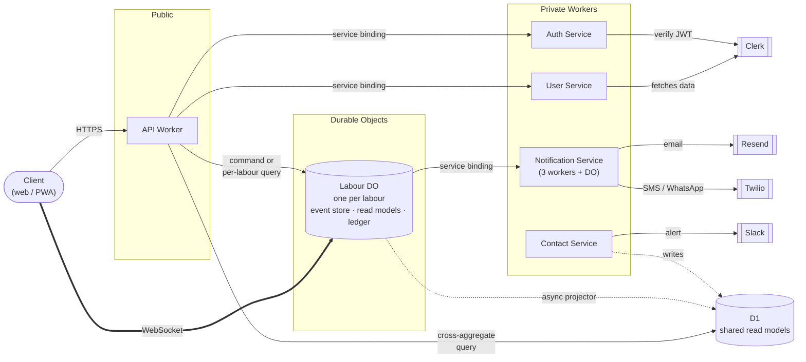

The backend is a full rewrite of the original Python/GCP stack onto Cloudflare Workers and Durable Objects in Rust. Each labour is its own Durable Object with its own SQLite event store, projections, and WebSocket subscribers.

Commands run synchronously on a single thread inside the DO, so appends never race, and an alarm fires immediately after the response to run sync projectors (DO-local SQLite), broadcast events to connected WebSockets, run async projectors (to D1, for cross-labour queries), and dispatch effects via a process manager.

Side effects (notifications, issuing follow-up commands, generating subscription tokens) go through a policy/effect ledger with per-effect idempotency keys, so alarm retries can't double-send.

See [Event sourcing on Cloudflare Workers and Durable Objects](/posts/event-sourcing-cloudflare) for a full walkthrough of the architecture, and the earlier [Fern Labour (legacy)](/projects/fernlabour-legacy) project for the original Python/GCP backend it replaced.
